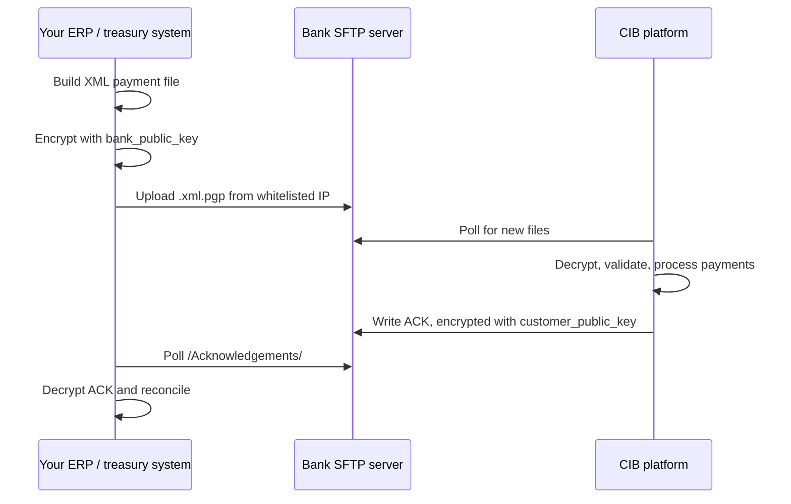

Host-to-Host (H2H) lets your ERP or treasury system send payment instructions directly to First Bank DRC's CIB platform. Files travel over an encrypted SFTP connection, so there's no need to key or upload payments in the Web Portal.

H2H suits organisations with high payment volumes or payments generated automatically by their finance systems.

<Warning>
Every payment file must follow the [H2H file specification](/en/host-to-host/file-specifications) and be encrypted with the Bank's PGP public key before upload. Files that don't conform, or aren't encrypted, are rejected without being processed.
</Warning>

## Supported payment types

| # | Payment type | Description |
|---|---|---|
| 1 | **Intrabank, single currency** | Between two First Bank DRC accounts in the same currency (CDF or USD) |
| 2 | **Intrabank, multi-currency** | Between two First Bank DRC accounts in different currencies |
| 3 | **Interbank, local currency (LCY)** | To an account at another DRC bank, in CDF |
| 4 | **Interbank, foreign currency (FCY)** | To an account at another DRC bank, in a foreign currency such as USD |
| 5 | **Foreign transfer** | Cross-border, to an overseas bank identified by its SWIFT/BIC code |

## How it works

H2H uses a push and pull model over SFTP. You push encrypted payment files to your folder on the Bank's SFTP server. The CIB platform picks them up, processes them, and writes an encrypted acknowledgement file back to your folder for you to collect.

<Steps>
  <Step title="Build the file">
    Your system creates the payment file in the prescribed XML format.
  </Step>
  <Step title="Encrypt it">
    Encrypt the file with the Bank's PGP public key (`bank_public_key`).
  </Step>
  <Step title="Upload it">
    Connect to the SFTP server from your whitelisted static IP address with your SFTP username and password. Upload the encrypted file (`.xml.pgp` or `.xml.gpg`) to your customer folder.
  </Step>
  <Step title="The Bank processes it">
    The CIB platform picks up the file, decrypts it, and checks it against the specification and business rules. Valid payments are sent to the right payment rail: intrabank, interbank, or foreign.
  </Step>
  <Step title="Collect the acknowledgement">
    The platform writes an XML acknowledgement, encrypted with your PGP public key (`customer_public_key`), to the `/Acknowledgements/` folder. Your system collects it, decrypts it with your private key, and reconciles the results.
  </Step>
</Steps>

<Note>
The CIB platform checks for new files at set intervals, so processing is not instant. The Bank confirms the polling interval and processing times during onboarding.
</Note>

## Where to go next

<CardGroup cols={2}>
  <Card title="Onboarding" icon="list-check" href="/en/host-to-host/onboarding">
    The 12 steps to go live, and who does what.
  </Card>
  <Card title="Security and keys" icon="lock" href="/en/host-to-host/security">
    PGP encryption, IP whitelisting, and SFTP access.
  </Card>
  <Card title="File specifications" icon="file-code" href="/en/host-to-host/file-specifications">
    XML structure and fields for all five payment types.
  </Card>
  <Card title="Acknowledgements" icon="file-circle-check" href="/en/host-to-host/acknowledgements">
    Read results and status codes for every payment.
  </Card>
</CardGroup>
