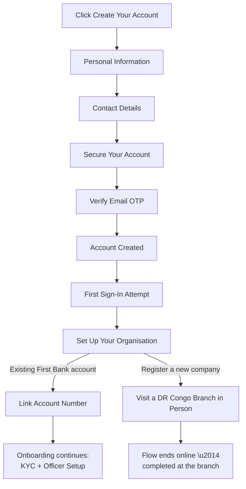

The Web Portal is where most of your day-to-day banking activity happens: onboarding, account management, payments, and approvals.

## Sign-up flow at a glance

<Note>
"Register a new company" is **not** a digital flow. The platform directs the user to visit a First Bank DRC branch in person to open a corporate account. Only "I have an existing First Bank account" continues online.
</Note>

<Note>
The Organisation Code used to sign in is **not** created during signup. It's assigned separately by First Bank DRC (e.g., via your relationship manager) once your company/account setup is confirmed.
</Note>

## Creating your account

<Steps>
  <Step title="Click Create Your Account">
    From the Sign In screen, select **Create your account**.
  </Step>
  <Step title="Personal Information">
    Enter your **First Name** and **Last Name**.
  </Step>
  <Step title="Contact Details">
    Enter your **Email** and **Phone number** (with country code, e.g. +243).
  </Step>
  <Step title="Secure Your Account">
    Create a password. It must be at least 8 characters and include an uppercase letter, a lowercase letter, a number, and a special character. Confirm the password.
  </Step>
  <Step title="Verify Your Email">
    Enter the 6-digit OTP sent to the email address you provided, then select **Verify OTP**.
  </Step>
  <Step title="Account Created">
    You'll see a confirmation that your user was created successfully, and you'll be returned to the Sign In screen.
  </Step>
</Steps>

## Signing in

The Sign In screen requires three fields:

| Field | Where it comes from |
|---|---|
| **Organisation Code** | Assigned separately by First Bank DRC, not created during signup |
| **Email** | The email you registered during signup |
| **Password** | The password you set during signup |

<Warning>
Without an Organisation Code, sign-in cannot be completed. The screen shows "Organisation code is required." If you haven't received yours yet, contact your relationship manager.
</Warning>

## Setting up your organisation

The first time you attempt to sign in, you won't have an Organisation Code yet, because none has been linked to your new user account. Instead of the standard sign-in, you'll land on **Set up your organisation**, which offers two paths:

<Frame caption="Set up your organisation: choose to link an existing account or register a new company">
  
</Frame>

<Tabs>
  <Tab title="I have an existing First Bank account">
    Select this option to link your company's existing First Bank account number. This continues digitally: you'll proceed to link your account and carry on toward KYC document upload and officer setup.

    <Frame caption="Existing account option shown selected">
      
    </Frame>
  </Tab>

  <Tab title="Register a new company">
    Select this option only if your company has never held a First Bank account before.

    <Warning>
    This path is **not** self-service. Selecting it opens a modal explaining that registering a new company requires an in-person visit to the nearest First Bank DR Congo branch. Once the branch has set up your corporate account, you return to this screen and select "I have an existing First Bank account" instead to continue online.
    </Warning>

    <Frame caption="Register a new company: redirects to an in-person branch visit">
      
    </Frame>

    The modal provides First Bank DRC's contact email and phone number as a fallback for questions before visiting a branch.
  </Tab>
</Tabs>

## What happens next

<Info>
For companies linking an existing account, further onboarding (including **KYC document upload**) happens after organisation setup. You can then add your team under [Officers](/en/web-portal/administration/officers).
</Info>

## Navigating the Web Portal

Once you're signed in, the sidebar is your main way of moving around the platform. It's grouped into seven sections:

<Frame caption="Web Portal sidebar: Dashboard, Account Services, Approval Queue, and Payment Services">
  
</Frame>

<Frame caption="Web Portal sidebar: Payment Services, Administration, Settings, and Support">
  
</Frame>

| Sidebar section | Modules |
|---|---|
| **Dashboard** | Dashboard |
| **Account Services** | Accounts, Transactions, Statements, Cheque Management, Beneficiaries, Virtual Token, Sweep Payments |
| **Approval Queue** | Activities Queue, Transaction Queue |
| **Payment Services** | Send Money, Own Account Transfer, FCY Interbank Transfer, Bulk Transfer, Invoices, Standing Instructions, Bank to Wallet |
| **Administration** | Officers, Officer Settings, Organisation Settings, Roles & Permissions |
| **Settings** | Settings |
| **Support** | Support |

<Note>
Your next step after signing in is usually to add the people who will operate the account. See [Officers](/en/web-portal/administration/officers).
</Note>
