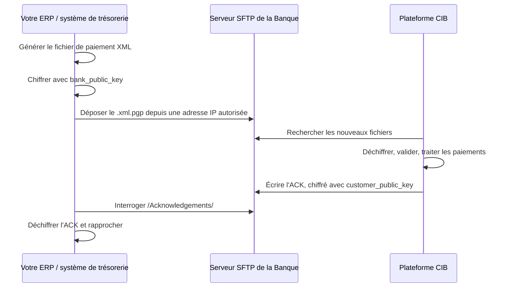

Le Host-to-Host (H2H) permet à votre ERP ou à votre système de trésorerie d'envoyer des ordres de paiement directement à la plateforme CIB de First Bank DRC. Les fichiers transitent par une connexion SFTP chiffrée : vous n'avez donc pas besoin de saisir ni de charger vos paiements dans le Portail Web.

Le H2H convient aux organisations qui traitent d'importants volumes de paiements ou dont les paiements sont générés automatiquement par leurs systèmes financiers.

<Warning>
Chaque fichier de paiement doit respecter la [spécification des fichiers H2H](/host-to-host/file-specifications) et être chiffré avec la clé publique PGP de la Banque avant son dépôt. Les fichiers non conformes ou non chiffrés sont rejetés sans être traités.
</Warning>

## Types de paiement pris en charge

| N° | Type de paiement | Description |
|---|---|---|
| 1 | **Intrabancaire, monodevise** | Entre deux comptes First Bank DRC dans la même devise (CDF ou USD) |
| 2 | **Intrabancaire, multidevise** | Entre deux comptes First Bank DRC dans des devises différentes |
| 3 | **Interbancaire, monnaie locale (LCY)** | Vers un compte dans une autre banque de la RDC, en CDF |
| 4 | **Interbancaire, devises (FCY)** | Vers un compte dans une autre banque de la RDC, dans une devise étrangère telle que l'USD |
| 5 | **Virement international** | Transfrontalier, vers une banque étrangère identifiée par son code SWIFT/BIC |

## Fonctionnement

Le H2H repose sur un modèle de dépôt et de récupération (push et pull) via SFTP. Vous déposez des fichiers de paiement chiffrés dans votre dossier sur le serveur SFTP de la Banque. La plateforme CIB les récupère, les traite, puis dépose en retour dans votre dossier un fichier d'accusé de réception chiffré que vous récupérez.

<Steps>
  <Step title="Générez le fichier">
    Votre système crée le fichier de paiement au format XML prescrit.
  </Step>
  <Step title="Chiffrez-le">
    Chiffrez le fichier avec la clé publique PGP de la Banque (`bank_public_key`).
  </Step>
  <Step title="Déposez-le">
    Connectez-vous au serveur SFTP depuis votre adresse IP statique autorisée (en liste blanche), avec votre nom d'utilisateur et votre mot de passe SFTP. Déposez le fichier chiffré (`.xml.pgp` ou `.xml.gpg`) dans votre dossier client.
  </Step>
  <Step title="La Banque le traite">
    La plateforme CIB récupère le fichier, le déchiffre et le contrôle au regard de la spécification et des règles de gestion. Les paiements valides sont acheminés vers le circuit de paiement approprié : intrabancaire, interbancaire ou international.
  </Step>
  <Step title="Récupérez l'accusé de réception">
    La plateforme écrit un accusé de réception XML, chiffré avec votre clé publique PGP (`customer_public_key`), dans le dossier `/Acknowledgements/`. Votre système le récupère, le déchiffre avec votre clé privée et rapproche les résultats.
  </Step>
</Steps>

<Note>
La plateforme CIB recherche les nouveaux fichiers à intervalles réguliers : le traitement n'est donc pas instantané. La Banque confirme l'intervalle d'interrogation et les délais de traitement lors de l'intégration (onboarding).
</Note>

## Pour aller plus loin

<CardGroup cols={2}>
  <Card title="Intégration" icon="list-check" href="/host-to-host/onboarding">
    Les 12 étapes jusqu'à la mise en production, et le rôle de chacun.
  </Card>
  <Card title="Sécurité et clés" icon="lock" href="/host-to-host/security">
    Chiffrement PGP, liste blanche d'adresses IP et accès SFTP.
  </Card>
  <Card title="Spécifications des fichiers" icon="file-code" href="/host-to-host/file-specifications">
    Structure XML et champs pour les cinq types de paiement.
  </Card>
  <Card title="Accusés de réception" icon="file-circle-check" href="/host-to-host/acknowledgements">
    Consultez les résultats et les codes de statut de chaque paiement.
  </Card>
</CardGroup>
