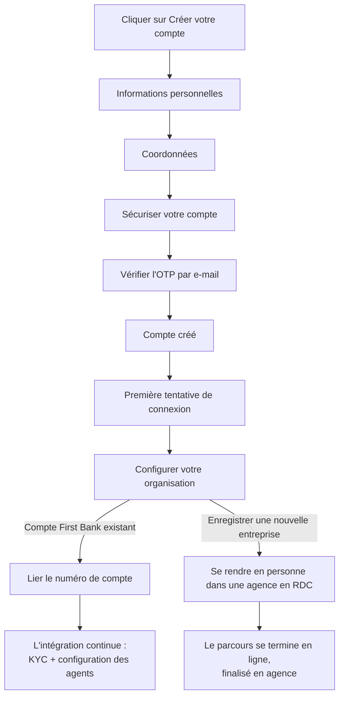

Le Portail Web est l'endroit où se déroule l'essentiel de votre activité bancaire quotidienne : intégration, gestion des comptes, paiements et approbations.

## Aperçu du parcours d'inscription

<Note>
« Enregistrer une nouvelle entreprise » n'est **pas** un parcours numérique. La plateforme invite l'utilisateur à se rendre en personne dans une agence First Bank DRC pour ouvrir un compte corporate. Seule l'option « J'ai un compte First Bank existant » se poursuit en ligne.
</Note>

<Note>
Le Code organisation utilisé pour se connecter n'est **pas** créé lors de l'inscription. Il est attribué séparément par First Bank DRC (par exemple via votre chargé de clientèle) une fois la configuration de votre entreprise et de votre compte confirmée.
</Note>

## Créer votre compte

<Steps>
  <Step title="Cliquer sur Créer votre compte">
    Depuis l'écran de connexion, sélectionnez **Créer votre compte**.
  </Step>
  <Step title="Informations personnelles">
    Saisissez votre **Prénom** et votre **Nom**.
  </Step>
  <Step title="Coordonnées">
    Saisissez votre **E-mail** et votre **Numéro de téléphone** (avec l'indicatif pays, par ex. +243).
  </Step>
  <Step title="Sécuriser votre compte">
    Créez un mot de passe. Il doit comporter au moins 8 caractères et inclure une majuscule, une minuscule, un chiffre et un caractère spécial. Confirmez le mot de passe.
  </Step>
  <Step title="Vérifier votre e-mail">
    Saisissez le code OTP à 6 chiffres envoyé à l'adresse e-mail fournie, puis sélectionnez **Vérifier l'OTP**.
  </Step>
  <Step title="Compte créé">
    Une confirmation indique que votre utilisateur a été créé avec succès, et vous êtes redirigé vers l'écran de connexion.
  </Step>
</Steps>

## Se connecter

L'écran de connexion requiert trois champs :

| Champ | Provenance |
|---|---|
| **Code organisation** | Attribué séparément par First Bank DRC, non créé lors de l'inscription |
| **E-mail** | L'e-mail enregistré lors de l'inscription |
| **Mot de passe** | Le mot de passe défini lors de l'inscription |

<Warning>
Sans Code organisation, la connexion ne peut pas aboutir. L'écran affiche « Le code organisation est requis ». Si vous ne l'avez pas encore reçu, contactez votre chargé de clientèle.
</Warning>

## Configurer votre organisation

Lors de votre première tentative de connexion, vous n'aurez pas encore de Code organisation, car aucun n'a encore été associé à votre nouveau compte utilisateur. Au lieu de l'écran de connexion standard, vous arriverez sur **Configurer votre organisation**, qui propose deux parcours :

<Frame caption="Configurer votre organisation : choisir de lier un compte existant ou d'enregistrer une nouvelle entreprise">
  
</Frame>

<Tabs>
  <Tab title="J'ai un compte First Bank existant">
    Sélectionnez cette option pour lier le numéro de compte First Bank existant de votre entreprise. Ce parcours se poursuit numériquement : vous procédez à la liaison de votre compte, puis à l'envoi des documents KYC et à la configuration des agents.

    <Frame caption="Option compte existant affichée sélectionnée">
      
    </Frame>
  </Tab>

  <Tab title="Enregistrer une nouvelle entreprise">
    Sélectionnez cette option uniquement si votre entreprise n'a jamais détenu de compte First Bank auparavant.

    <Warning>
    Ce parcours n'est **pas** en libre-service. Le sélectionner ouvre une fenêtre expliquant que l'enregistrement d'une nouvelle entreprise nécessite une visite en personne à l'agence First Bank RDC la plus proche. Une fois votre compte corporate configuré par l'agence, vous revenez à cet écran et sélectionnez « J'ai un compte First Bank existant » pour continuer en ligne.
    </Warning>

    <Frame caption="Enregistrer une nouvelle entreprise : redirige vers une visite en agence">
      
    </Frame>

    La fenêtre fournit l'e-mail et le numéro de téléphone de contact de First Bank DRC en cas de questions avant de vous rendre en agence.
  </Tab>
</Tabs>

## Et ensuite ?

<Info>
Pour les entreprises qui lient un compte existant, la suite de l'intégration (dont l'**envoi des documents KYC**) a lieu après la configuration de l'organisation. Vous pouvez ensuite ajouter votre équipe dans [Agents](/web-portal/administration/officers).
</Info>

## Naviguer dans le Portail Web

Une fois connecté, le menu latéral est votre principal moyen de navigation dans la plateforme. Il est organisé en sept sections :

<Frame caption="Menu latéral du Portail Web : Tableau de bord, Services de compte, File d'approbation et Services de paiement">
  
</Frame>

<Frame caption="Menu latéral du Portail Web : Services de paiement, Administration, Paramètres et Support">
  
</Frame>

| Section du menu | Modules |
|---|---|
| **Tableau de bord** | Tableau de bord |
| **Services de compte** | Comptes, Transactions, Relevés, Gestion des chèques, Bénéficiaires, Jeton virtuel, Virements automatiques |
| **File d'approbation** | File des activités, File des transactions |
| **Services de paiement** | Envoyer de l'argent, Virement entre comptes, Virement interbancaire devises, Virement groupé, Factures, Instructions permanentes, Banque vers portefeuille |
| **Administration** | Agents, Paramètres agents, Paramètres organisation, Rôles et permissions |
| **Paramètres** | Paramètres |
| **Support** | Support |

<Note>
Après votre connexion, l'étape suivante consiste généralement à ajouter les personnes qui vont opérer le compte. Consultez [Agents](/web-portal/administration/officers).
</Note>
